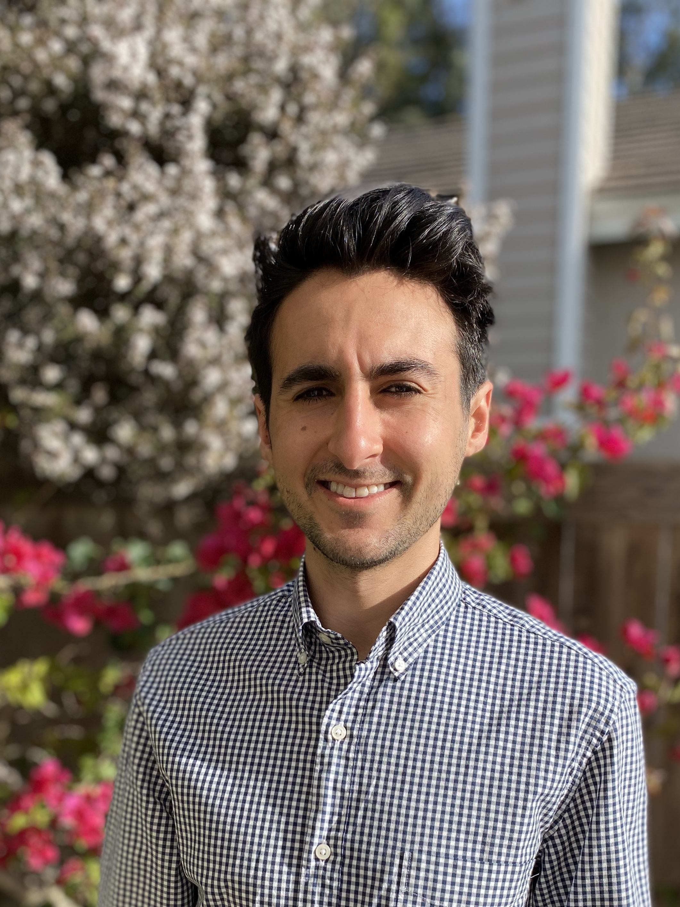

I am currently a Financial Research Fellow at Northwestern University in the Kellogg School of Management In May 2020, I graduated from the University of California at Berkeley with honors in Economics. My research interests include monetary policy, multinational firms and economic development.

This website will contain all my [research](https://noahforougi.github.io/noahforougi/research.html), my [CV](https://noahforougi.github.io/noahforougi/cv.html) and any other [projects/blog posts](https://noahforougi.github.io/noahforougi/blog.html). 

 
